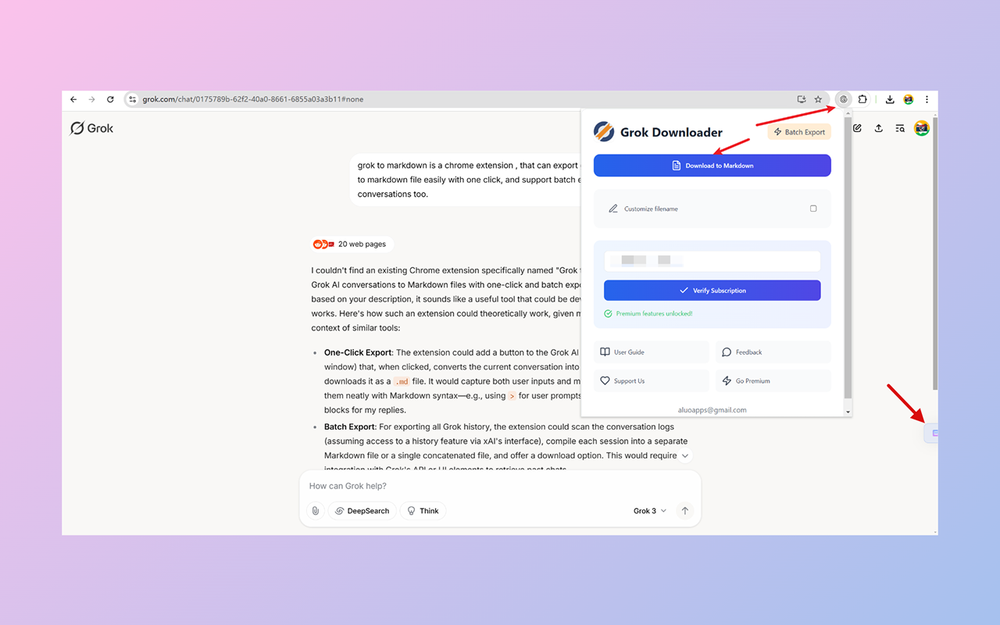
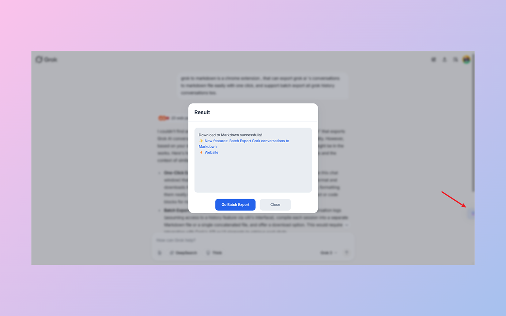
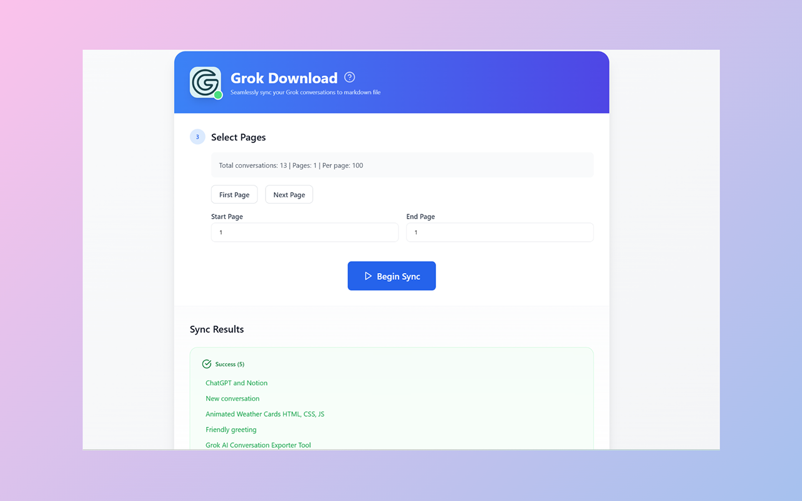

# Grok Downloader - Save Grok Conversations with One Click

  

  
  
  

<h2 id="english">English</h2>

## ✨ Features

### 🚀 One-Click Save
- Floating "Download" button on Grok chat interface
- Instantly save current conversation to your device
- Smart extraction of chat title, content, and timestamp

### 📚 Batch Download
- Bulk download historical conversations
- Customizable page range selection
- Real-time progress tracking
- Cancellable download operations

### 🔄 Flexible Export Options
- Multiple format support (Markdown/HTML/Text)
- Custom file naming
- Organized folder structure
- File conflict handling

### 🔌 Local Storage
- Direct save to local device
- Automatic folder organization
- Easy access to saved conversations
- Efficient file management

## 🎯 Use Cases

1. **Knowledge Management**
   - Preserve valuable Grok conversations
   - Build your personal knowledge base locally

2. **Team Collaboration**
   - Share important AI conversations
   - Export conversations for team use

3. **Content Archiving**
   - Batch backup historical chats
   - Prevent loss of important conversations

## ⚙️ Setup Guide

1. **Initial Setup**
   - Install the extension
   - Choose default save location

2. **Download Configuration**
   - Select export format
   - Configure file naming pattern
   - Set download preferences

## 💫 Key Advantages

- Clean and modern user interface
- Real-time download progress
- Detailed success/failure logs
- Multiple export formats
- Comprehensive error handling

## 🛠️ Technical Support

- Compatible with latest Grok Chat
- Supports major browsers
- Regular updates and maintenance
- Professional technical support

## 🚀 Roadmap

- Enhanced format customization
- Performance optimization
- Advanced file organization
- Additional export templates

## 📝 License

This project is licensed under the MIT License - see the [LICENSE](LICENSE) file for details.

  

  

  

